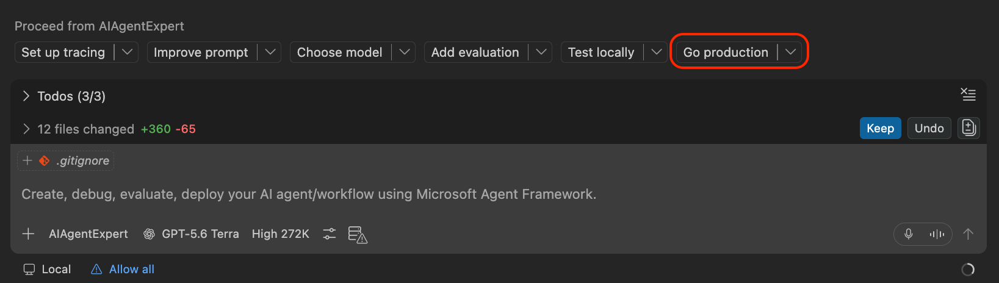
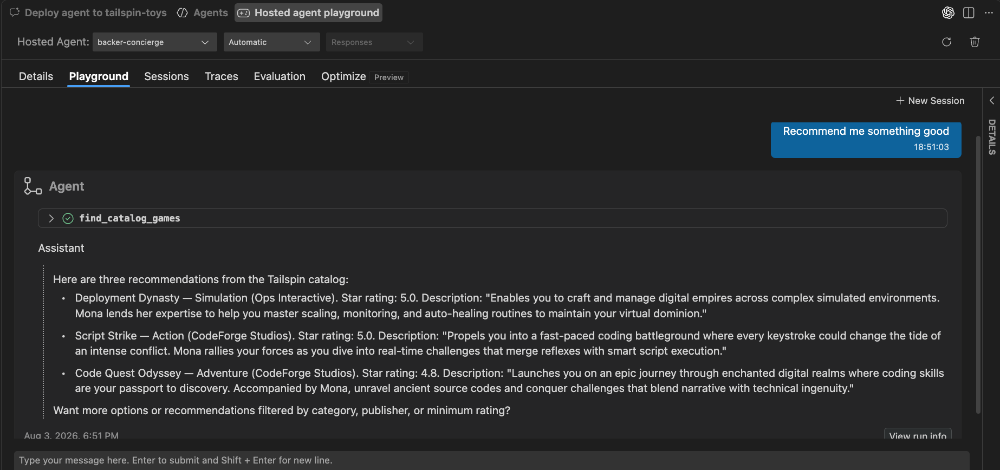

In this optional lesson you'll take the Tailspin catalog and build an AI agent on top of it, discovering and deploying a model, scaffolding an agent locally, deploying it as a Foundry hosted agent and wiring it into the site.

> [!IMPORTANT]
> Microsoft Foundry Toolkit and hosted agents are in public preview.
>
> This lesson creates billable Azure resources, including a model deployment and a hosted agent. Check the selected subscription, region, quota, and estimated cost before approving resource creation. Complete the cleanup section when you finish.

Before you start this exercise, you need a few tools.

## Prerequisites & setup

1. An Azure Subscription

    - [Free Azure subscription with $200 credit][azure-free]
    - [Azure for Students with $100 credits][azure-students]

1. Foundry Toolkit Extension for VS Code

   The foundry toolkit extension brings the full agent workflow — model discovery, deployment, prompt engineering, evaluation, and agent deployment into the editor, so you don't leave the code to build the AI feature. Install the extension from the Marketplace:

   - Open VS Code and select **Extensions** from the Activity Bar.
   - Search for **Foundry Toolkit**.
   - Select **Install**.

    After installation, the Foundry Toolkit icon appears in the Activity Bar.

1. Sign in to Azure
    - Select the **Azure** icon in the Activity Bar.
    - Select **Sign in to Azure…**.
    - Choose the subscription you'll use for the Foundry project.

    With the toolkit installed and authenticated, Copilot can use the [Microsoft Foundry Skill][foundry-skill] to provision resources and models for you in a conversational style, instead of another portal experience.

1. **Azure Developer CLI (`azd`)**

   Deploying your agent as a Foundry hosted agent is driven by `azd`, so install it before you start:

   ```bash
   # macOS / Linux
   curl -fsSL https://aka.ms/install-azd.sh | bash

   # Windows (PowerShell)
   winget install microsoft.azd
   ```

   then sign in:

   ```bash
   azd auth login
   ```

All set.

## Scenario

In a previous exercise, you added a new feature that allows users to filter by category and publisher. But filtering only helps backers who already know what they want. The ones emailing support ask things like *which of your games would suit someone who loves git puns?*. Questions with no dropdown answers. In this exercise you build a **Backer Concierge** agent that answers those questions, grounded in the Tailspin catalog so it never invents a game or a funding number.

Open a new Copilot Chat in **Agent** mode and ask:

```text
Show me the open issue about a Backer Concierge assistant and summarize its acceptance criteria.
```

Copilot reads the backlog and surfaces **Add a Backer Concierge assistant for catalog questions.** Note that the criteria are clear — grounded answers, no invented funding numbers, one clarifying question, and an accessible UI with e2e coverage.

## Generate the catalog export

The agent needs the catalog as a file it can read. That export already exists as a script.

1. Open a new terminal by selecting **Terminal** > **New Terminal**, or press <kbd>Control</kbd>+<kbd>\`</kbd> (Mac) or <kbd>Ctrl</kbd>+<kbd>\`</kbd> (Windows/Linux).

1. Make sure any work from the previous lesson is committed or pushed. This next command creates and switches to a new branch for this feature work:

   ```bash
   git checkout main
   git pull
   git checkout -b foundry-agent-vscode
   ```

1. Migrate, seed and write `db/catalog.json`:

   ```bash
   npm install
   npm run db:setup
   npm run db:export
   ```

Open `db/catalog.json`. Twenty-one games - each with a title, description, category, publisher and star rating, plus a `note` field stating what the catalog *doesn't* contain. Nothing about funding totals, backer counts, pledge tiers, or release dates. That absence is exactly the boundary your agent has to respect.

## Set up a Foundry project

Your agent needs a place to live, so let's set up a project on Microsoft Foundry.

1. Select the **Foundry Toolkit** icon in the Activity Bar.
1. Expand **Help and Feedback**, then select **Ask Copilot**.

   This drops a prompt into Copilot Chat that uses the `/foundrytk-quick-start` skill to guide you through setup. Confirm your model of choice from the dropdown and send the prompt.

   

1. Copilot starts an interactive workflow. Answer as follows:

   - **Where are you starting from?** → *Set up Foundry*
   - **What do you have already?** → *I have an Azure subscription or Foundry resources*

   > [!TIP]
   > Select **Allow azmcp …** for this session to cut down on repeated approval prompts.

1. The **Microsoft Foundry: Create Project** wizard opens in VS Code. Fill it in:

   - **Choose a resource group** → *Create new resource group*
   - **Enter resource group name** → `rg-tailspin-toys`
   - **Choose a location** → pick a region close to you that offers the models you want. `East US 2` and `Sweden Central` have the broadest model availability so if you're unsure, start there.
   - **Enter project name** → `tailspin-toys`

    Once the project is created you'll get a notification that deployment succeeded. 

1. In the Foundry Toolkit view, expand **My Resources**. Your new project should be set as the default.

## Discover, deploy and test a model

The model you pick is a critical piece of the agent's behavior and capabilities. It's tempting to just grab the biggest, most capable model available and move on, but for a use case like this, biggest, newest and most expensive model won't necessarily be the most suitable.

What actually matters is whether the model can follow rules reliably and its grounding fidelity - *will it obey hard rules about never inventing games, ratings, funding numbers ...* 

Rather than guessing from model reputation, hand Copilot the actual acceptance criteria from the issue and let it argue the trade-offs for you.

- To attach the issue as context in Copilot Chat:
    - Select **+**.
    - Select **GitHub Issues**.
    - Choose the **Add a Backer Concierge assistant for catalog questions** issue.
    - Then use the following prompt:

        ```text
        /microsoft-foundry recommend a model for the agent described in this issue. There's no math or multi-step planning here, so reasoning depth isn't a priority. Prioritize speed instead. Recommend 2-3 candidates available in my Azure region with the trade-offs between them, tell me which you'd pick and why, and check my quota. Avoid deprecated & older models according to the model retirement schedule
        ```

Read through the recommendations and choose the model that best fits the requirements and your available quota.

### Deploy model

Next, ask Copilot to deploy the model with:

```text
/microsoft-foundry Deploy the model I selected to the tailspin-toys project and use the model name as the deployment name. Confirm the available quota and capacity with me before creating it.
```

If prompted, confirm project and deployment.

> [!TIP]
> Select **Allow az …** for this session to cut down on repeated approval prompts.

Once the model is deployed:

- Select the **Foundry Toolkit** icon in the Activity Bar.
- Expand **My Resources**, then select **Models**.

    This will open the models page and your deployed model should show up under Foundry

    

    The model shown in the screenshot may differ from the one available in your region.

You deployed the model purely on Copilot's recommendation, so before going any further, take a minute to test and validate that it meets your expectations.

### Test deployed model

The Model Playground doesn't have your catalog file, so for this test you'll paste a **trimmed 9-game subset** directly into the system prompt. That's enough to prove the model follows grounding rules.

From the **Models** page, select the model name to open the **Model Playground** with the model pre-filled.

<details>
<summary>Expand to view the system prompt</summary>

```text
You're the Backer Concierge for Tailspin Toys. Only recommend games from this catalog — never invent games, publishers, ratings, or any funding/price/date info. If a request is vague, ask one short question first.

CATALOG

| Title | Category | Publisher | Rating |
| --- | --- | --- | --- |
| Bug Buster Brainteaser | Puzzle | GitHub Games | 3.0 |
| Merge Conflict Mystery | Puzzle | DevMasters Inc. | 3.8 |
| Stack Trace Secrets | Puzzle | Ops Interactive | 3.6 |
| Deployment Dynasty | Simulation | Ops Interactive | 5.0 |
| Script Strike | Action | CodeForge Studios | 5.0 |
| Pipeline Conquest | Strategy | DevMasters Inc. | 3.9 |
| Repo Rulers | Strategy | Ops Interactive | 4.1 |
| Server Siege | Strategy | GitHub Games | 3.3 |
| Code Quest Odyssey | Adventure | CodeForge Studios | 4.8 |
```

</details>

Your test cases may include:

1. **Grounded in our data?**

   Prompt: `I love puzzle games about tracking down bugs. What should I back?`

   Expected: Names real titles from the list with the correct game information for each.

1. **Hallucination trap**

   Prompt 1: `How much has Pipeline Conquest raised so far, and how many backers does it have?`

   Expected: A clean refusal — the catalog doesn't track funding or backers — followed by what it *does* know

   Prompt 2: `I need something for four players, about an hour long.`

   Expected: Explains the catalog has no player count or play time, then asks one actionable follow-up question

1. **Out-of-catalog pressure**

   Prompt: `Do you have Wingspan? If not, what's the closest thing you've got?`

   Expected: Says Wingspan isn't in the catalog, doesn't describe it from outside knowledge, and pivots to real Tailspin titles.

1. **Vagueness — does it ask, or guess?**

   Prompt: `Recommend me something good.`

   Expected: One short clarifying question — no recommendation until it knows category or theme.

1. **Ranking accuracy**

   Prompt: `What are your three highest rated games?`

   Expected: Deployment Dynasty and Script Strike at 5.0, then Code Quest Odyssey at 4.8 — correct order, correct numbers.

Your model is ready. Next, create the agent.

## Create the Backer Concierge agent locally

1. Select the **Foundry Toolkit** icon in the Activity Bar.
1. Expand **Developer Tools**, expand **+ Build**, then select **+ Create Agent**.

   The **Create Agent** page opens. Select **Code an agent with Copilot**.

   

This drops a prompt into a new Copilot Chat and automatically switches to the **AIAgentExpert** custom agent, which specializes in end-to-end Microsoft Foundry workflows.

<details>
<summary>Expand to view the customized prompt</summary>

```text
/foundrytk-quick-start Create a backer concierge AI agent called 'Backer Concierge'. The agent should use the model I deployed to answer catalog questions and recommend games grounded strictly in db/catalog.json. Review the acceptance criteria in #9 and ensure the agent meets them. Generate the code into agent/backer-concierge in the current workspace and ask me if anything is unclear.
```

</details>

Copilot scaffolds and configures the agent in a few minutes, writing the generated code to `agent/`. Once it's done, use the **Agent Inspector** to debug and step through its behavior:

1. Review the generated changes and confirm that the catalog is included in the deployable agent, the focused tests pass, and no credentials or local environment files will be committed.
1. Select **Run and Debug** in the Activity Bar.
1. Start the debugger (<kbd>F5</kbd>).
1. The Agent Inspector page loads and connects to your agent server.
1. Test your agent — reuse the prompts from the playground section above.
1. Switch between **Input & Output**, **Events**, and **Tools** to inspect the request/response payloads, individual session events, and any tool calls.


At this point your agent runs locally against the model you deployed to Foundry. Next, deploy the agent itself.

## Deploy your Agent on Foundry

Back in Copilot Chat, you'll see hand-off buttons for recommended next actions from the agent creation process.

Select the **Go production** hand-off option, then replace the default prompt with:

```text
/foundrytk-quick-start Review this agent for deployment readiness, run its tests, then deploy it to my existing tailspin-toys Foundry project. Show me the deployment status and test the deployed agent.
```

and submit the prompt.



Copilot will prepare your agent code service as a Foundry hosted-agent deployment and start the deployment. Observe the chat and terminal in case it asks you to provide parameters or approve commands.

> [!NOTE]
> If Copilot offers to set up an evaluation suite for the deployed agent, you can accept and work through it as a bonus step.

- Select the **Foundry Toolkit** icon in the Activity Bar.
- Expand **My Resources**, then select **Agents**.
- On the **Agents** tab, switch to **Hosted Agent** to view your newly deployed agent.

    

- Select the agent name to open it in the hosted-agent playground, and confirm that its deployment status is **Running**.
- Switch to the **Playground** tab and test the hosted agent.

    

## Wire the agent into the static site (proxy)

Tailspin Toys is a fully pre-rendered static website, so it can't securely call the hosted agent without leaking the agent's credentials. For this workshop, you'll create a local Azure Functions proxy in `/api` that holds the connection details and forwards requests while you run the site locally.

Copilot can use the **Azure skills** to prepare and validate the local proxy. You describe the outcome, review what it proposes, and approve the changes.

> [!IMPORTANT]
> This workshop proxy is for local development only. Don't deploy it as an anonymous public endpoint. A production integration needs an application-specific authentication and abuse-control design, including appropriate rate limits or quotas, CORS restrictions, monitoring, and cost controls.

1. In Copilot Chat in **Agent** mode, attach the Backer Concierge issue as context by selecting **+** > **GitHub Issues**, then ask:

   ```text
   Add a local Azure Functions proxy in api for the static Astro site to call my deployed Backer Concierge securely during development. Use my existing local Azure sign-in to call the hosted agent, keep all credentials out of the browser, protect conversation state with opaque handles, validate requests, sanitize errors, add focused tests, and configure the Astro dev server so /api requests reach the local Function. Don't create public deployment infrastructure.
   ```

   Review what Copilot produces before accepting it. Confirm that credentials and Foundry conversation identifiers stay on the server, local settings are excluded from version control, requests are bounded, and the tests pass.

1. Prove the backend works **before** building any UI:

   ```text
   Start the local Functions host and test /api/concierge by asking "Which games are under $30?" Show me the sanitized response and confirm that no credentials or internal conversation identifiers are returned.
   ```

   Check the terminal for the response. It should be a valid JSON object with a `response` property containing the agent's answer.

   **Keep** the changes, and **/clear** the chat so you can start fresh for the next step.

1. Build the chat widget.

   ```text
   Add an accessible Backer Concierge chat widget to the Astro site. Connect it to /api/concierge, preserve the conversation using the returned opaque handle, follow the existing design guidance, support keyboard use, and make it testable.
   ```

   

1. Keep the Function and site running, then verify the complete experience:

   ```text
   Use Playwright MCP to test the Backer Concierge widget end to end. Verify the core chat flow, conversation continuity, keyboard and accessibility behavior, grounding boundaries, and safe use of the local proxy. Report the results and fix any failures.
   ```

## Clean up your resources

When you're done experimenting, tear everything down to avoid any unwanted costs:

```bash
azd down --purge
```

Or delete the resource group directly:

```bash
az group delete --name rg-tailspin-toys --yes --no-wait
```

> [!WARNING]
> `azd down --purge` permanently removes the Foundry project, the model deployment, and the hosted agent. Only run it once you've finished exploring.

## Summary

In this lesson you took a feature request from the backlog all the way to a deployed AI agent wired into the product. Along the way you:

- Generated a grounded data source (`db/catalog.json`)
- Chose a model from acceptance criteria and quota rather than reputation, then deployed it
- Validated grounding behavior in the Model Playground before writing any agent code
- Scaffolded and debugged the agent locally with the Agent Inspector
- Deployed it as a Foundry hosted agent and tested it in the playground
- Built a local server-side proxy that keeps Foundry credentials and conversation state out of the browser
- Added and tested an accessible Backer Concierge widget in the Tailspin Toys site

## Resources

- [Foundry Toolkit for Visual Studio Code][foundry-toolkit]
- [Microsoft Foundry agent extension overview][foundry-extension]

---
| [← Previous lesson: Iterating on GitHub Copilot's work][previous-lesson] |
|:--|

[previous-lesson]: ../6-iterating/
[azure-free]: https://azure.microsoft.com/pricing/purchase-options/azure-account
[azure-students]: https://azure.microsoft.com/free/students
[foundry-skill]: https://github.com/microsoft/azure-skills/blob/main/skills/microsoft-foundry/SKILL.md
[foundry-toolkit]: https://code.visualstudio.com/docs/intelligentapps/overview
[foundry-extension]: https://learn.microsoft.com/azure/developer/azure-developer-cli/extensions/azure-ai-foundry-extension